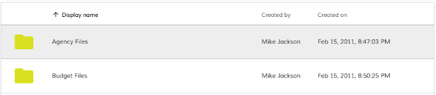
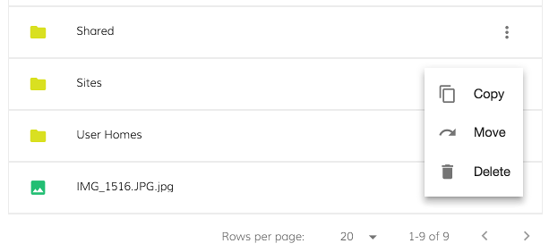
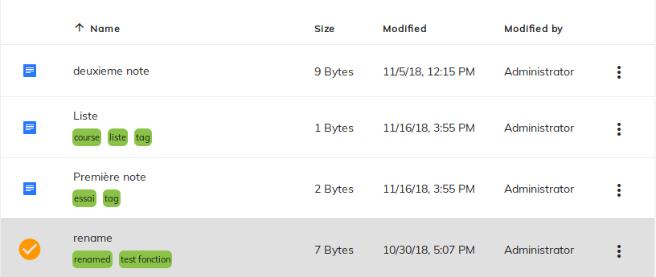
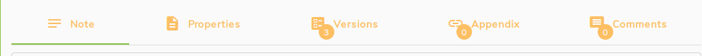

# Exemple de développement ADF

## ADF document List

Le composant document List est le composant dataTable de base ADF. Il permet l'affichage des documents à partir d'un dépôt Alfresco.

Pour l'instancier dans un projet, il y a juste besoin d'écrire les balises du composant dans le template de son composant parent.

```html
<adf-document-list
    [currentFolderId]="'-my-'">
</adf-document-list>
```

L'input `currentFolderId` est l'id du dossier à afficher dans la datatable.

Par défaut avec deux dossiers dans le répertoire, il ressemble à cela :



### Ajouts et modifications de la datatable

Je vais présenter ici, plusieurs modifications effectuées sur l'élément documentList ADF-Notepad.

#### Ajout d'actions sur le contenu

Pour ajouter la possibilité d'effectuer des actions sur le contenu de la datatable. Il faut procédé ainsi :
- Ajout et changement de l'input `[contentActions]="true"` qui est par défaut en false.

- Ajout dans le template de la balise `content-actions` qui crée le menu d'action pour chaque fichier de la datatable.

- Ajout dans le template des balises `content-action` qui constitue les actions sur le contenu. L'ordre des balises dans le template est l'ordre des actions dans le menu `content-actions`.

Voici à quoi ressemble le template :

```html
<adf-document-list
    [currentFolderId]="'-my-'"
    [contentActions]="true"
    ...>

    <content-actions>

        <content-action
            icon="get_app"
            target="document"
            title="DOCUMENT.CONTENT_ACTION.DELETE"
            handler="delete">
        </content-action>

        <content-action
            icon="content_copy"
            target="document"
            title="NODE_SELECTOR.COPY"
            permission="update"
            handler="copy"
            (execute)="moveEvent('Copied',$event)">
        </content-action>

        <content-action
            icon="gesture"
            target="document"
            title="DOCUMENT.CONTENT_ACTION.RENAME"
            permission="update"
            (execute)="rename($event)">
        </content-action>

        ...

    </content-actions>

</adf-document-list>
```

La première action `delete` est une action possible par défaut. Il en existe quatre : download, delete, copy et move. Elles sont définies par l'input `handler`.

La dernière est une action personnalisée `rename` qui sert à modifier le titre du document. Pour créer une action personnalisée, il faut appeler une fonction sur l'événement (execute) du content action. Ici, c'est l'action `rename` du composant parent.

On peut mélanger les deux et faire deux actions en même temps lors d'un clic sur un bouton d'action.
C'est le cas du deuxième content-action de l'exemple.

D'autres Events tel que le `success` ou `error` peuvent être ajoutés pour agrémenter ces actions.

Voici à quoi peut ressembler un menu d'actions sur le contenu :



#### Colonnes personnalisées

Il est possible de réorganiser et modifier totalement les colonnes de la datatable.
IL faut procéder de la même manière que pour les `content-actions` :

- Ajout dans le template de la balise `data-columns`.

- Ajout dans le template des balises `data-column` qui constitue les différentes colonnes de la datatable. L'ordre des balises dans le template est l'ordre des colonnes dans la datatable.

Par défaut, plusieurs colonnes sont définies dans ADF. Ajouter la balise data-columns permet de créer les colonnes que l'on souhaite mais efface les colonnes par défauts.

Voici à quoi ressemble le template :

```html
<adf-document-list
    [currentFolderId]="'-my-'"
    [contentActions]="true"
    ...>

    <data-columns>
        <data-column
            key="$thumbnail"
            type="image"
            [sortable]="false">
        </data-column>

        <data-column
            title="ADF-DOCUMENT-LIST.LAYOUT.NAME"
            key="name"
            class="adf-data-table-cell--ellipsis__name">
            <ng-template let-entry="$implicit">
                <span>{{ entry.row.getValue('name') }}</span>
                <adf-tag-node-list  [nodeId]="entry.row.getValue('id')"></adf-tag-node-list>
            </ng-template>
        </data-column>

        <data-column
            key="content.sizeInBytes"
            type="fileSize"
            title="ADF-DOCUMENT-LIST.LAYOUT.SIZE">
        </data-column>

        <data-column
            key="modifiedAt"
            type="date"
            format="short"
            title="ADF-DOCUMENT-LIST.LAYOUT.MODIFIED_ON">
        </data-column>

        <data-column
            key="modifiedByUser.displayName"
            title="ADF-DOCUMENT-LIST.LAYOUT.MODIFIED_BY">
        </data-column>

    </data-columns>

    ...

</adf-document-list>
```
La deuxième colonne est personnalisée avec un composant affichant les tags associés au document.
Les modifications possibles sont nombreuses : [voir documentation data-column](https://alfresco.github.io/adf-component-catalog/components/DataColumnComponent.html#basic-usage).

Le résultat des colonnes personnalisées dans ADF-Notepad est ceci :




#### Filtrer les documents

Pour l'application ADF-Notepad, une fois dans le blog du site, j'ai du filtrer les documents afin qu'il ne reste que les fichiers textes ou notes d'affichées.
Pour cela, on peut mettre en place un filtre dans le composant document list.

Ce filtre s'ajoute grâce à l'input `rowFilter` dans la balise du composant.

Dans ADF-Notepad, il se présente ainsi :

```html
<adf-document-list
    #documentList
    [currentFolderId]="currentFolder?.id"
    [contentActions]="true"
    [rowFilter]="nodeFilter"
...>
```

`nodeFilter` est défini dans la classe du composant parent d'adf-document-list.

Pour ne pas prendre en compte les dossiers par exemple, on peut mettre en place le filtre comme ceci :

```ts
nodeFilter: RowFilter;

...

this.nodeFilter = (row: ShareDataRow) => {
    const node = row.node.entry;
    if (node && !node.isFolder) {
        return true;
    }
    return false;
};
```
<p class="warning">
    Attention ! Les éléments "filtrés" ne seront pas affichés mais seront tout de même présents et apparaîtront dans la pagination.
</p>

## Afficher le nombre d'annexes

Dans ADF-Notepad, lorsqu'une note est sélectionnée, on affiche son contenu, ses propriétés, versions, annexes et commentaires dans le composant `info-drawer` qui se sépare en plusieurs onglets comme ceci :



Les trois derniers onglets sont équipés d'un badge permettant d'afficher le nombre de versions, d'annexes ou de commentaires liés à la note sélectionnée.
Ce nombre vient des composants version, appendix et comment fils du composants qui créé les onglets. Pour les avoir, il faut que les données remontent dans le composant parent.

### Obtenir l'information

Dans le cas d'ADF-notepad, les onglets se chargent à la volée.
Lorsque l'on clique sur une note, le premier onglet `Note` charge,s'affiche et montre le contenu de la note que l'on peut modifier.
C'est une fois chargé que les autres composants contenus dans les autres onglets sont chargés à leur tour.

Il en est de même lorsque l'on change de sélection de note et que l'on se trouve sur un onglet, l'onglet sélectionné charge avant les autres.

<p class="warning">
    Problème : Si les composants ne sont pas chargés, on ne peut pas obtenir le nombre à afficher dans les badges des onglets. Cela empêche l'application de fonctionner correctement et d'afficher l'info-drawer.
</p>

En effet, les ouputs ou les variables de référence de template ont besoin que le composant soit chargé pour être fonctionnel et envoyer le nombre de versions liées à la note par exemple.

<p class="tips">
    Pour résoudre ce problème, on créé un service qui va transmettre l'information de façon asynchrone à l'onglet.
</p>

### Exemple du composant Annexes

Dans le projet ADF-Notepad, j'ai donc créé un service que j'appelle TabManagement. Dedans, je créé un observable (ici, un subject) qui permettra de transmettre de manière asynchrone le nombre d'annexes liées à ma note :

```ts
import { Injectable } from '@angular/core';
import { Subject } from 'rxjs';

@Injectable({
  providedIn: 'root'
})
export class TabManagementService {

  constructor() { }

  appendixCount$ = new Subject<number>();
}
```

Une fois, cet observable créé, je n'ai plus qu'à dire au composant appendix d'envoyer le nombre d'annexes liées à la note quand celles-ci sont chargées.
Il faut bien sûr importer le service dans les composants qui l'utilise et le déclarer dans leur constructeur.

```ts
loadAssociations(): void {
    this.isLoading = true;
    this.alfrescoApi.getInstance().core.associationsApi.listTargetAssociations(this.nodeId).then((data: NodeAssocPaging) => {
        this.appendixNodes = data.list.entries;
        this.isLoading = false;
        this.tabManagementService.appendixCount$.next(data.list.pagination.count);
    });
}
```

Pour récupérer ce nombre, je peux faire une simple [subscriptions](/guide-developpement#subscription) que je gère dans le composant parent ou plus simple, j'utilise le pipe async Angular directement dans son template :

```html
<app-info-drawer-tab icon="link" label="{{'DOCUMENT.CONTENT_VIEW.LINKDOC' | translate}}" badge="{{ tabManagementService.appendixCount$ | async }}">
    <mat-card *ngIf="tabReady || infoDrawer.selectedIndex == 3">
        <mat-card-content>
            <app-appendix [node]="node" (success)="documentList.reload()"></app-appendix>
        </mat-card-content>
    </mat-card>
</app-info-drawer-tab>
```

Ce pipe va récupérer la dernière valeur envoyée par l'observable, si cette valeur change, le pipe async déclenche un cycle OnChange du composant. Il unsubscribe automatiquement lors de la destruction du composant pour éviter les potentielles fuites de mémoires.

Grâce à ce procédé, on peut charger les onglets tour à tour sans bug. Les valeurs attendues dans les badges changent automatiquement lorsque les subjects créées dans le tabManagementService émettent.
